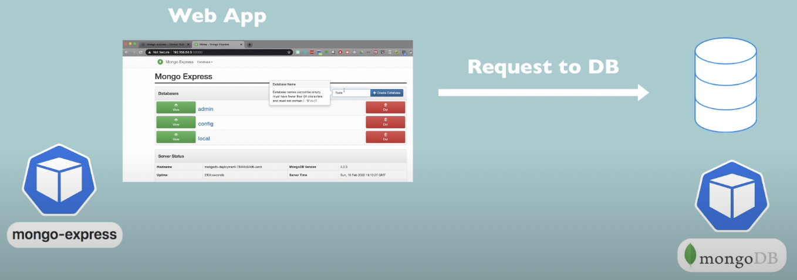

# App-deployment-using-kubernetes
Mongo(mongodb + mongo-express) Application Setup on Kubernetes Cluster

I have deployed two applications mongo-express and mongodb representing complete web application setup in kubernetes pods.

K8 Components used:

- 2 Deployments/pods.
- 2 Services
- 1 ConfigMap
- 1 Secret

# Steps Followed:

1. Creation pod for MongoDB
2. Creation of internal Service for talking with pod
3. Creation of Mongo Express pod
4. Creation of ConfigMap and Secret and referencing them in Deployment.yml file
5. Creation of external service inorder to access the Mongo Express in browser.

ConfigMap → DB Url

Secret → Secret

# Request Flow:

![image]

# Process:

- Created secret.yml and refrenced it in mongo.yml(values are base64 encoded - To get base64 values echo -n ‘your-db-username/password’ | base64 in terminal)
![image]
- Created deployment file mongo.yml
- Deploying the configuration files using kubectl
![image]
![image]
- Check the pod status
![image]
- Creating the internal service(created in same file: mongo.yml)
- Now, creating a configuration file mongo-express.yml
- Creating mongo-configmap.yml
- Deploying the mongo-express.yml and mongo-configmap.yml

Final Workflow:
![image]

